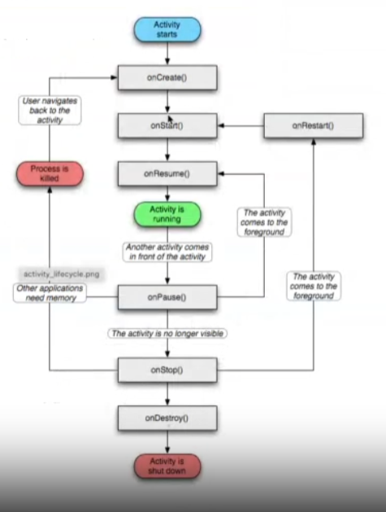

# Apuntes desarrollo aplicaciones

# TEORIA

- # Arquitectura de una app Android

    ### 1. Vistas:
    Son los elementos con los que se disena la interfaz de usuario, cuadrados, botones... Todos objetos heredan de la clase View de Java
    - XML Android:

        - Los ficheros XML son ampliamente extendidos en Kotlin. El fichero por defecto es `activity_main.xml`.
        - Contiene los elementos de la interfaz de usuario, los atributos de diseno, los layouts, string, colores, dimensiones y demas elementos de UI.
    ### 2. Layout:
    Conjunto de vistas colocadas o agrupadas, dispone de diferentes tipos de layouts para organizar las vistas de forma lineal.
    ### 3. Activity:
    Un activity son las pantallas visuales que forman parte de la interfaz de la app. Cada activity es el componente principal de una app de Android. Por cada actividad hay que crear una clase heredada de Activity de Java
    - Estados de una actividad:
        - Created: Nada mas iniciarse se ejecuta el `onCreate`, es obligatorio que sea sobreescrito. 
        - Started: A continuacion del created pasariamos al `onStart`, es cuando la actividad empieza a ser visible en pantalla.
        - Resumed: Se ejecuta `onResume` al salir del started, en este punto la actividad puede ser pausada o parada.
        - Paused: Llegamos aqui cuando se quita el foco, pj una ventana emergente. Este proceso se llama `onPause`. Desde aqui podriamos volver al estado resumed con `onResume` o podriamos pararla con `onStoped`.
        - Stoped: Aqui llegamos cuando hemos parado la activity, se llega aqui cuando se inicia otra avtividad y esta queda en un segundo plano. Una actividad stoped puede volver a started mediante `onRestart` y `onStart`
        - Destroyed: Aqui se llega cuando se finaliza la app, se llega mediante `onDestroy`, se llega desde paused.

        -  

    ### 4. Intencion:
    Es un mensaje que se envia de un componente a otro, entre una app y otra, se suelen usar para ejecutar un servicio o una actividad.
    - Explicitos: Indican que compionente se debe iniciar.
    - Implicitos: No se especifica el nombre, lo que hace es indicar la operacion.
    ### 5. Servicios
    Es un componente que permite realizar operaciones de larga duracion en background. Algunos ejemplos son:
    - Sincronizar app en la nube 
    - Reproducir musica
    - Monitorear info
    Hay dos tipos de servicios
    - Started service: comienza llamando al metodo `startService`.
    - Bound service: comienza llamando al metodo `bindService`.

- # Arquitectura de Android Studio

    Esta compuesto por 3 carpetas principales

    ### Manifest
    Dentro de esta carpeta se encuentra el archivo `AndroidManifest.xml`, aqui se indican los componentes que formam la App, la API minima y las librerias que necesitan.
    ### Java
    Se aloja el codigo Java de la app, se accedera para modificar y crear nuevos archivos de codigo fuente Java.
    ### Res
    Aqui estan la mayoria de archivos de la App, imagenes, traducciones, animaciones, estilos ...
    - Carpeta `Drawable`: Contiene los archivos graficos en formato .png .gif .jpg y archivos xml.
    - Carpeta `Layout`: Contiene los xml que definen la disposicion de los elementos.
    - Carpeta `Menu`: Contiene los ficheros xml que contienen los menus de la aplicacion.
    - Carpeta `Values`: Contiene los ficheros xml que definen valores simples como enteros, colores y constantes de texto. Aqui se encuentra el fichero `string.xml`.
    - Carpeta `MiniMap`: Almacena los iconos de la aplicacion.

- # Interfaces de usuario (UI)

    ### 1. Layout
    Actua como contenedor de view. Se puede organizar en ficheros xml o con codigo Java. La mejor opcion es xml. 
    Los tipos de layout son:
    - LinearLayout: Organiza los elementos en una fila o en una columna.
    - TableLayout: Organiza los elementos en filas y columnas. Este tipo de Layout necesita el tipo TableRow, para crear filas dentro de esa tabla.
    - RelativeLayout: Muestra los elementos en posiciones relativas con respecto a otro elemento o un Layout padre.
    - AbsoluteLayout: Posiciona el elemento usando coordenadas x , y.
    - FrameLayout: Permite mostrar varios elementos en la misma región de la pantalla, de modo que cada uno de ellos oculta al que está por debajo.
    - ConstraintLayout: Esta Layout se añadió en Android Studio 2.2 y versiones posteriores, permite una edición visual desde el editor sin tener que modificar manualmente el XML.
    ### 2. View
    Son usados para dibujar contenido, algunos elementos son 
    - Widgets
    - Text
    - Containers

- # Contexto grafico
    Android permite dibujar imagenes en formato .jpg y .png. Se pueden agregar de diferentes maneras:
    - Canvas, es una superficie que se pinta.
    - View, forma sencilla de generar un grafico, pero poco flexible.
    - SurfaceView, esta recomendado si la informacion va a necesitar muchas actualizaciones. Se necesitara un thread

    ### Clases y metodos

    - Metodo onPaint
    - Metodo para dibujar formas geometricas, perteneneciente a la clase canvas, drawLine, drawpoint, drawRect y drawCircle
    - Metodo de la clase path, camino a seguir entre linea y curvas.
    - Metodo drawable
    - Metodo y clase BitmapDrawable

- # Threads
    Hilos de ejecucion

    ### Ciclos de vida
    - New
    - Runnable, una vez ejecutado el `start`
    - Not Runnable
    - Dead
    ### Asyntask
    Es una clase al igual que Handler, para mostrar los cambios generados en el thread, creada para reducir y simplificar el desarrollo de threads.

- # BBDD SQLite
    - Tiene las siguientes ventajas:
        - No necesita configuracion
        - Tiene un conjunto de librerias escritas en C, no funciona con el modelo cliente-servidor
        - Solo tiene un archivo
        - Es de codigo abierto
        - Android tiene todo lo necesario para crear y ejecutar las bases de datos de este tipo, asi como una api optimizada para ella
    - Como desventajas tenemos:
        - Funciones reducidas en comparacion a MYSQL o PostgreSQL
        - Escalabilidad limitada
        - Carece de caracteristicas de sql avanzadas como right, outer, join...
        - Bloquea la BBDD en cada escritura

- # Fases de un videojuego
    - Inicio del motor
    - Carga de recursos
    - Inicio del juego
    - Bucle principal
    - Entrada
    - Logica
    - Renderizado

    El bucle se mantiene entre el renderizado y la entrada por parte del usuario

- # Bloques funcionales de un videojuego
    - ### Motor de fisicas
        - Simulacion dinamica, aplica las leyes de la fisica
        - Modulo de colisiones, evita las colisiones
            - Detecta colisiones mediante boolean
            - Determina la colision, calculando el punto de interseccion
            - Calcula la respuesta de la colision
        ##### Aqui se implementa la interfaz ApplicationListener, y sus metodos son:
        - create, cuando el juego es creado
        - dispose, cuando el juego se destruye
        - pause, cuando se pausa el juego
        - render, cuando el juego se renderiza
        - resume, cuando el juego se inicia despues de una pausa
    - ### Motor de renderizado
         Es un framework encargado de dibujar los graficos, hay dos librerias principales
        - Vulkan, api de bajo nivel para graficos 3D
        - OpenGl
    - ### Motor de inteligencia artificial
    - ### Motor de sonido

# Preguntas test

## Tema 1

- Para que sirve un AVD
    - Para ver nuestros proyectos en un dispositivo virtual
- Sistemas mas actuales
    - Android e iphone
- Directorio Drawable
    - Guarda los archivos graficos
- Cual es el unico requisito para utilizar android
    - Tener version de JDK 7 y el SDK
- Donde esta el archivo manifest
    - Manifest
- Primera version Android
    - 2008
- ¿Para que sirve el archivo strings.xml?
    - Para almacenar todas las cadenas de texto del proyecto
- ¿Se puede programar en IOS de forma libre?
    - No
- ¿Para que sirve el directorio Layout?
    - Aquí tenemos los diferentes XML que definen los elementos de la pantalla y su disposición
- ¿Para que sirve el directorio Values?
    - Aquí tendremos los ficheros XML con definiciones de valores simples como enteros, colores o constantes de texto.
- ¿Una aplicación para android puede tener requisitos?
    - Si
- ¿Cual es la versión mas reciente de Android?
    - 14.X
- ¿Para que se utiliza el SDK manager?
    - Para descargar las diferentes versiones de android programables
- ¿Para que sirve el directorio Manifests?
    - Ninguna de las anteriores
- ¿Que contiene el archivo Android Manifest?
    - Lo componentes que forman la aplicación
    - Los permisos necesarios
    - El API minimo
- ¿Para que sirve el directorio Java?
    - Aquí es donde tendremos el código fuente Java que vayamos generando
- ¿Que tienen en común todas las versiones de Android?
    - Todas tienen nombre de dulces

## Tema 2
- ¿Para que sirve la propiedad id?
    - Para darle un identificador a un elemento
- ¿Cual de las siguientes etiquetas si pertenece a un TableLayout?
    - TableRow
- La mayoría de ficheros XML. en su primera línea de código...
    - Indican el encoding que tienen y la versión del XML
- ¿En que consiste un Relative Layout?
    - Este coloca los elementos de forma relativa respecto a su padre o sus hermanos
- Un widget:
    - Es una elemento gráfico
- Queremos poner un Padding de 20 ¿Como ponemos manualmente un valor en el Padding de un elemento?
    - 20dp
- ¿Por qué es necesario indicar la orientación en una table Layout?
    - Todo lo contrario, no la requieren.
- Los layouts se componen de...
    - Contenedores y widgets
- ¿Cual de los siguientes esta en desuso?
    - fill_parent
- ¿Se puede meter un Linear Layout dentro de otro?
    - se puede y es muy comun
- ¿A Que se refiere match_parent?
    - Se refiere a la altura y anchura total del contenedor
- ¿Cuál es la etiqueta que empleamos para indicar la anchura del layout?
    - Android:width
- ¿Para que sirve Android:layout_weight?
    - Para asignar un peso a un elemento
- ¿Qué clase comparten los contenedores y los widgets?
    - View
- La herramienta appt para definir los atributos de un layout crea una clase llamada...
    - R
    - R.java
- ¿Donde podemos encontrar el component tree?
    - En la parte derecha de la interfaz en la vista en modo Design

## Tema 3
## Tema 4
- En un proyecto LibGDX los recursos como imágenes, sonido se almacenan en:
    - Carpeta assets
- Las colisiones se implementan:
    - Por cada objeto que colisiona en el juego se debe crear un Body
- La clase AndroidLauncher de la librería LibGDX
    - Inicia el contexto gráfico
    - Implementa la interfaz AndroidApplication
    - Contiene el método onCreate
- Cuál de estos métodos no son de la interfaz ContactListener
    - setContactListener
- Si un Body es de tipo dinámico, se declara
    - BodyDef.BodyType.DynamicBody
- Del motor de físicas podemos decir:
    - Es un framework
    - Contiene un módulo para la detección de colisiones
    - Simula las propiedades físicas de los cuerpos
- Un sprite es:
    - Una imagen con más información como posición y velocidad
- isTouched es:
    - Un método de la clase Gdx.Input que se lanza cuando se pulsa sobre la pantalla
- Los algorimos de inteligencia artificial más usados para juegos son:
    - SSS
    - A*
    - MiniMax
- Los motores de sonido usan ficheros con formato
    - Pueden usar Mp3, WaV y OGG
- Todas las instrucciones usadas para dibujar en un juego debe estar:
    - Dentro del método render entre batch.begin y el método batch.end
- Las librerias para el desarrolo de juegos mas usadas son:
    - Allegro, Phase, Ccocos2D
- isKeyPressed podemos afirmar:
    - Un método de la clase Gdx.Input que se lanza cuando se presiona una tecla
- La fase de un juego encargada de ejecutar el propio juego se llama:
    - Bucle principal
- Cuál es la afirmación correcta:
    - Las texturas se implementan con la clase com.badlogic.gdx.graphics.Texture

## Tema 5

# Teoria desarrollo

### Indica cual es el ciclo de vida de una activity en Android y comenta brevemente lo que hace cada paso
- Created: Nada mas iniciarse se ejecuta el `onCreate`, es obligatorio que sea sobreescrito. 
- Started: A continuacion del created pasariamos al `onStart`, es cuando la actividad empieza a ser visible en pantalla.
- Resumed: Se ejecuta `onResume` al salir del started, en este punto la actividad puede ser pausada o parada.
- Paused: Llegamos aqui cuando se quita el foco, pj una ventana emergente. Este proceso se llama `onPause`. Desde aqui podriamos volver al estado resumed con `onResume` o podriamos pararla con `onStoped`.
- Stoped: Aqui llegamos cuando hemos parado la activity, se llega aqui cuando se inicia otra avtividad y esta queda en un segundo plano. Una actividad stoped puede volver a started mediante `onRestart` y `onStart`
- Destroyed: Aqui se llega cuando se finaliza la app, se llega mediante `onDestroy`, se llega desde paused.
### ¿Cuales son las ventajas / desventajas de una base de datos SQLite?
- Tiene las siguientes ventajas:
    - No necesita configuracion
    - Tiene un conjunto de librerias escritas en C, no funciona con el modelo cliente-servidor
    - Solo tiene un archivo
    - Es de codigo abierto
    - Android tiene todo lo necesario para crear y ejecutar las bases de datos de este tipo, asi como una api optimizada para ella
- Como desventajas tenemos:
    - Funciones reducidas en comparacion a MYSQL o PostgreSQL
    - Escalabilidad limitada
    - Carece de caracteristicas de sql avanzadas como right, outer, join...
    - Bloquea la BBDD en cada escritura

### En el motor de videojuegos unity, cual es la diferencia entre un método Update, Start y FixedUdate
- Start: Se llama una sola vez en la vida útil de un script, antes del primer frame. Se utiliza para inicializar variables o estados.
- Update: Se ejecuta en cada frame y se usa para la mayoría de las actualizaciones de juego, como movimiento de personajes, controles del usuario, etc.
- FixedUpdate: Se ejecuta de manera regular en intervalos fijos, lo que lo hace ideal para manipular físicas y otros elementos que requieran consistencia independiente de la velocidad del frame.
### En el motor de videojuegos unity, para que valen los componentes que se asocian a los gama object. Explica los principales
- Rigidbody: Añade física a un objeto, como gravedad o colisiones.
- Collider: Define la forma de un objeto para la detección de colisiones.
- MeshRenderer y MeshFilter: Renderizan la forma visual del objeto.
- Scripts personalizados: Permiten definir el comportamiento y la lógica del juego.
### Cuando queremos desarrollar aplicaciones móviles, ¿Cuáles son las posibilidades de desarrollo en las diferentes plataformas?
- Android: Desarrollo nativo con Java o Kotlin. Ofrece acceso completo a la funcionalidad del sistema operativo.
- iOS: Desarrollo nativo con Swift o Objective-C. Esencial para aplicaciones que requieren la última funcionalidad de iOS.
- Multiplataforma: Herramientas como Flutter, React Native,Ionic, o Xamarin permiten escribir código una vez y desplegarlo en múltiples plataformas. Ideal para aplicaciones que no requieren funcionalidades profundas del sistema operativo.
### En el caso de tener dos activitys en Android y queremos pasar de una a otra. ¿Cuál es el objeto que tenemos que utilizar? Y en el caso de querer pasar datos, ¿Qué tendríamos que hacer?
- Utilizar un Intent para iniciar una nueva activity. Para pasar datos, se pueden usar "extras" en el Intent, como intent.putExtra("clave", valor).
- En la segunda activity, recuperar los datos con getIntent().getExtra("clave").
### Cual es la diferencia entre un ListView y un RecyclerView. Explica brevemente como se gestionan las pulsaciones de un recycler view
- ListView: Más simple pero menos eficiente para listas grandes o complejas. No es tan flexible en términos de layout o animaciones.
- RecyclerView: Más eficiente y versátil. Mejor para manejar grandes conjuntos de datos o para diseños complejos. Las pulsaciones se gestionan a través del adaptador, asignando un OnClickListener a la vista en el método onBindViewHolder
### Define como se pueden escuchar pulsaciones sobre un elemento en Android. ¿Y si se quieren asociar el mismo escuchador a varios elementos?
- Implementar un View.OnClickListener y asignarlo a los elementos con setOnClickListener. Para múltiples elementos, se puede implementar el escuchador en el activity/fragment y asignarlo a cada elemento, o usar un enfoque similar con una clase interna o lambda.
### En el ciclo de vida de una pantalla, hay un método que se llama onCreate(), el cual tiene un método llamado setContentView. Indica que hace este método, su importancia y que archivos tiene relacionados
- setContentView en onCreate() establece el diseño de la interfaz de usuario de la activity, vinculándola con un archivo XML de layout. Es crucial para la configuración inicial de la interfaz de usuario.
### Cuando en una pantalla queremos diferenciar lo que se ve cuando el móvil está en horizontal y en vertical. ¿Qué es lo que tenemos que hacer? ¿Y si queremos que todos los string de nuestra aplicación estén disponibles en español e inglés?
- Crear diferentes archivos XML en layout (vertical) y layout-land (horizontal). Para soporte multilingüe, se usan directorios values con locales específicos, como values-es para español, y se definen los strings en archivos XML correspondientes.
### Indica la importancia de guardar el estado en una aplicación Android. ¿Cómo se realiza este guardado y recuperación?
- Se guarda el estado en onSaveInstanceState y se recupera en onCreate o onRestoreInstanceState, generalmente utilizando un Bundle para pasar datos simples como strings, enteros, etc.
### En kotlin, existe una característica llamada Null Safety. Indica que es y como funciona
- Evita errores de NullPointerException. En Kotlin, las variables son no nulas por defecto. Si se necesita una variable nula, se declara con ?. Kotlin proporciona operadores seguros (?.) y el operador Elvis (?:) para trabajar con valores nulos.
### Además de poder utilizar SQLite o Firebase como base de datos en Android, existe la posibilidad de utilizar la persistencia DataStore. Explica cuando utilizar cada una de ellas
El data store es una API de Android Studio para guardar de forma asincrona elementos de forma par clave valor dentro de nuestro proyecto. Al ser asincrono se tiene que utilizar mediante el cilo de vida de la app. 
### En unity, cuando queremos que varios objetos se comporten de la misma forma y/o tengan las mismas características y elementos, ¿Qué podríamos hacer?
- Utiliza Prefabs en Unity. Creas un objeto de juego con todas las características y comportamientos deseados, y luego lo conviertes en un Prefab. Este Prefab se puede utilizar para crear múltiples instancias del objeto en tu juego, asegurando que todos tengan las mismas propiedades y comportamientos.
### Imagina que estamos desarrollando un juego y queremos detectar cuando un nuestro jugador está en el suelo y/o se posa sobre el. ¿Qué tendríamos que hacer?
- Se pueden usar colisionadores y detectar colisiones mediante métodos como OnCollisionEnter en scripts. También se puede usar raycasting para proyectar un rayo desde el jugador hacia abajo y detectar si choca con el suelo.
- Usa Physics.Raycast para lanzar el rayo. Si el rayo choca con el suelo dentro de una cierta distancia, entonces el jugador está en el suelo.
- Este método se ejecuta en el método Update para chequear constantemente si el jugador está en contacto con el suelo.